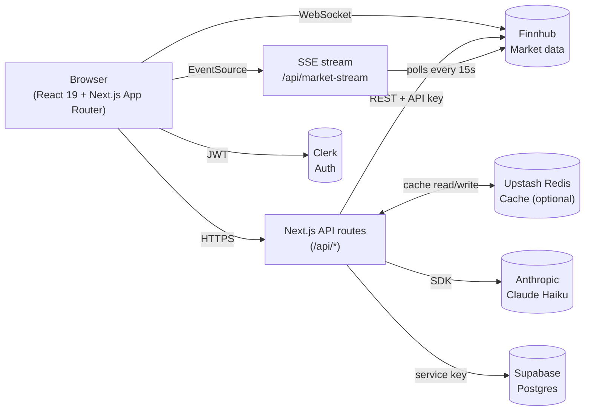

<h1 align="center">Stockify</h1>

<p align="center">
  <b>Real-time market intelligence dashboard — stocks, crypto, forex.</b><br/>
  Technicals · Fundamentals · AI analysis · Backtesting · Portfolio benchmarking
</p>

<p align="center">
  
  
  
  
  
  
</p>

---

## What this is

A fullstack market dashboard. One search box, any asset — get a complete breakdown in seconds: live quotes, technicals, fundamentals, news, earnings, analyst consensus, AI-generated bull/bear thesis, backtesting, portfolio benchmarking against the S&P 500.

Built as a portfolio project to demonstrate fullstack engineering, real-time data handling, and applied quant/AI.

## Live features

| Area | What it does |
|---|---|
| Search & analyze | Stocks, crypto (`BINANCE:BTCUSDT`), forex (`OANDA:EUR_USD`) — autocomplete, recent searches, Cmd+K focus |
| Live quotes | WebSocket price ticker for stocks. SSE stream pushes indices/movers every 15s |
| Technicals | RSI, MACD, SMA 20/50/200, EMA 20/50, ATR, volatility, 52-week position — computed client-side from candles |
| Composite score | Weighted signal (Strong Buy → Strong Sell) combining trend, momentum, sentiment, stability |
| AI Analyst | Streams a bull/bear thesis from Claude Haiku using quote + metrics + news as context |
| Backtesting | `/backtest` — run RSI, SMA cross, or MACD strategies over 1Y/2Y/5Y, compare to buy-and-hold, see equity curve + Sharpe + drawdown + trades |
| Portfolio | Holdings tracker with P&L, allocation, CSV import, and a 6-month chart benchmarking your portfolio against SPY with Sharpe/drawdown |
| Screener | Filter & sort top 50 S&P stocks by P/E, dividend yield, beta, market cap |
| Heatmap | Sector-based market heatmap with breadth stats |
| Watchlist | Drag-and-drop with live WebSocket prices |
| Compare | Side-by-side analysis of 2–4 tickers with normalized performance chart |
| Earnings | Weekly earnings calendar with EPS estimates |
| Alerts | Price alerts with browser + sound notification when triggered |
| Multi-currency | USD/EUR/GBP/ILS with Finnhub forex rates (falls back to hardcoded approximates) |
| Export | Per-ticker PDF and portfolio CSV |
| Auth | Clerk (Google + GitHub), protected routes for watchlist/portfolio |

## Architecture



**Key design decisions:**

- **Server-only API keys.** Finnhub and Anthropic keys never touch the browser — all calls go through `/api/*` routes. The only client-visible Finnhub touchpoint is the WebSocket, which uses a short-lived token minted by `/api/ws-token`.
- **Lazy env reads.** `lib/finnhub.ts` reads `process.env.FINNHUB_API_KEY` per request, not at module init. Required for Vercel serverless — module init runs before env vars are injected during some cold starts.
- **Redis cache is optional.** App works without Upstash; `lib/cache.ts` falls back to a no-op. Cache TTLs are tuned to the cost of staleness: quotes 30s, company 1h, metrics/recommendations 5min.
- **Batched fetching on expensive pages.** Heatmap and screener fetch in groups of 8 with 1.2s delays to stay under Finnhub's 60 req/min free-tier limit.
- **SSE instead of polling for market data.** `/api/market-stream` pushes a snapshot every 15s with a 20s heartbeat; the client uses `EventSource`. Single connection, no client-driven cadence.
- **Client-side technicals.** RSI/MACD/SMA are computed from raw candles in `lib/backtest.ts` and the home dashboard. Keeps the API lean and makes the backtest engine reusable.
- **Clerk over NextAuth.** Zero-config social providers, drop-in `<UserButton />`, middleware-based route protection. Saves a weekend of integration work.
- **Supabase over Prisma+Postgres.** Service-role key from server routes only; user_id comes from Clerk's `auth()`. No ORM overhead for three simple tables (watchlist, portfolio, alerts).

## Tech stack

| Layer | Stack |
|---|---|
| Framework | Next.js 15 (App Router), React 19, TypeScript 5 |
| Styling | Tailwind CSS 3, glassmorphism dark theme, custom CSS animations |
| Charts | Lightweight Charts v5 (TradingView open-source), TradingView widget |
| Auth | Clerk v7 (`@clerk/nextjs`) with Google/GitHub OAuth |
| Database | Supabase (Postgres) — `watchlist`, `portfolio`, `alerts` |
| Cache | Upstash Redis (optional) |
| Market data | Finnhub REST + WebSocket |
| AI | Anthropic Claude Haiku via `@anthropic-ai/sdk` (streaming) |
| Real-time | Server-Sent Events for market overview, WebSocket for per-stock ticks |
| Analytics | Vercel Analytics + Speed Insights |
| Testing | Jest + React Testing Library |
| Deployment | Vercel |

## Getting started

```bash
git clone https://github.com/Barel-dev/Stockify.git
cd Stockify
npm install
cp .env.example .env.local   # fill in keys
npm run dev
```

Required env:

```
FINNHUB_API_KEY=                        # finnhub.io (free tier works)
NEXT_PUBLIC_CLERK_PUBLISHABLE_KEY=      # clerk.com
CLERK_SECRET_KEY=
SUPABASE_URL=                           # supabase.com
SUPABASE_SERVICE_ROLE_KEY=
```

Optional:

```
ANTHROPIC_API_KEY=                      # enables AI Analyst
UPSTASH_REDIS_REST_URL=                 # enables response caching
UPSTASH_REDIS_REST_TOKEN=
```

Supabase schema:

```sql
create table watchlist (
  id uuid default gen_random_uuid() primary key,
  user_id text not null,
  symbol text not null,
  company_name text not null default '',
  added_at timestamptz default now()
);
create unique index idx_watchlist_user_symbol on watchlist(user_id, symbol);

create table portfolio (
  id uuid default gen_random_uuid() primary key,
  user_id text not null,
  symbol text not null,
  shares numeric not null,
  buy_price numeric not null,
  company_name text not null default '',
  created_at timestamptz default now()
);

create table alerts (
  id uuid default gen_random_uuid() primary key,
  user_id text not null,
  symbol text not null,
  target_price numeric not null,
  direction text not null check (direction in ('above','below')),
  triggered boolean default false,
  created_at timestamptz default now()
);
```

## Project layout

```
app/
  page.tsx                # main search + dashboard
  backtest/page.tsx       # strategy playground
  compare/page.tsx        # 2-4 ticker comparison
  watchlist/page.tsx      # live-priced watchlist
  portfolio/page.tsx      # holdings + SPY benchmark
  screener/page.tsx       # S&P 500 screener
  heatmap/page.tsx        # sector heatmap
  earnings/page.tsx       # earnings calendar
  stock/[symbol]/page.tsx # SEO route -> redirects to main
  api/
    quote, search, company, candles, news, earnings,
    earnings-calendar, recommendations, metrics,
    price-target, exchange-rates,
    watchlist, portfolio, alerts,
    ws-token,
    market-stream (SSE),
    analyze       (streamed AI)

components/
  Navbar, Background, StockChart, TradingViewChart,
  AIAnalyst, PortfolioBenchmark,
  OnboardingTour, KeyboardShortcuts, ErrorBoundary, Skeleton

lib/
  finnhub       - API wrapper (lazy env read)
  supabase      - lazy client
  cache         - Upstash w/ no-op fallback
  backtest      - indicators + backtest engine
  currency      - USD/EUR/GBP/ILS
  use-currency, use-live-prices, use-alert-checker
  export        - PDF + CSV
```

## Scripts

```bash
npm run dev        # dev server @ localhost:3000
npm run build      # production build
npm run lint       # ESLint
npm run test       # Jest
npm run test:ci    # Jest --ci --passWithNoTests
```

## Rate-limit notes

Finnhub free tier is 60 req/min. Stockify mitigates this by:
- Caching quote/company/metrics responses in Redis with sensible TTLs.
- Batching fetches on heatmap/screener in groups of 8 with spacing.
- Sharing the SSE stream so every client shows the same market snapshot.
- Only calling stock-specific endpoints when the ticker is a stock (`!symbol.includes(":")`).

## License

ISC.
